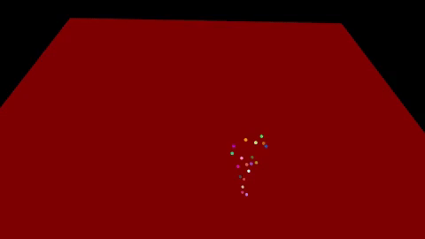
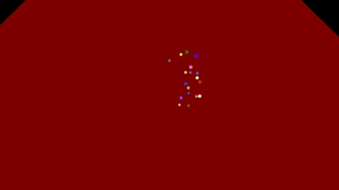
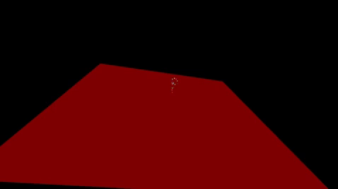

# gait-analysis-dataset
Raw dataset from "Signal Processing and Machine Learning for Diplegia Classification" and "Gait-Based Diplegia Classification Using LSMT Networks"

# Introduction
Diplegia is one of the most common forms of a broad family of motion
disorders named cerebral palsy (CP) affecting the voluntary
muscular system. In recent years, various
classification criteria have been proposed for CP, to assist in diagnosis, clinical decision-making and communication. 

# Data
Dataset is available [HERE](https://drive.google.com/open?id=1ErKsk-7y6Z7ixHLEgBLAQ_9RdeoQwfWt).

Our dataset refers to 1139 trials acquired from 178 patients affected by different stages of diplegia using high frequency VICON
cameras in an Italian hospital.
WARNING: some trials may be invalid (e.g. invalid markers throughout the sequence).
## X
Each .npy file has a variable number of frames. 
For each frame, 19 markers are reported with 3D coordinates (first 3 elements) along with a validation flag.
If you're interested in other markers or other medical indicators, please write me an email.
## Y
The path to a .npy file is the follow:
```
base_folder/class_label/subject_label/.npy 
```
# Utils
Along with the script employed to extract .npy file, the repo comes with a handy minimal visualizer based on [Open3D](http://www.open3d.org/).
Here are some examples:

<table style="width:100%">
    <tr>
        <th>
            <p align="center">
            
            <br>Class 0 example.
            </p>
        </th>
        <th>
            <p align="center">
            
            <br>Class 1 example.
            </p>
        </th>
     </tr>
 </table>

<table style="width:100%">
    <tr>
        <th>
            <p align="center">
            
            <br>Class 2 example.
            </p>
        </th>
        <th>
            <p align="center">
            
            <br>Class 3 example.
            </p>
        </th>
     </tr>
 </table>

# How to cite
If you have employed our dataset in your research (or you want to give as some free refs :D),
please cite **both** the followings:
```
@inproceedings{bergamini2017signal,
  title={Signal Processing and Machine Learning for Diplegia Classification},
  author={Bergamini, Luca and Calderara, Simone and Bicocchi, Nicola and Ferrari, Alberto and Vitetta, Giorgio},
  booktitle={International Conference on Image Analysis and Processing},
  pages={97--108},
  year={2017},
  organization={Springer}
}


@article{ferrari2019gait,
  title={Gait-Based Diplegia Classification Using LSMT Networks},
  author={Ferrari, Alberto and Bergamini, Luca and Guerzoni, Giorgio and Calderara, Simone and Bicocchi, Nicola and Vitetta, Giorgio and Borghi, Corrado and Neviani, Rita and Ferrari, Adriano},
  journal={Journal of Healthcare Engineering},
  volume={2019},
  year={2019},
  publisher={Hindawi}
}

```
